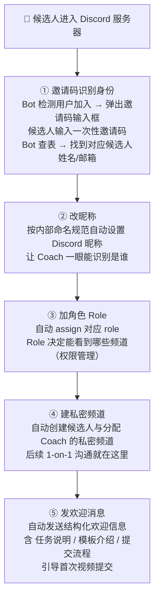

# 02 · Bot Design · 5 步自动化 + 邀请码机制

## 🏗️ The 5-Step Auto Onboarding Pipeline



## 🔑 邀请码识别身份机制（核心）

### Why It Matters
没有邀请码 = Bot 不知道新加入的人是谁 = 完全没法自动化。这是整个系统的**入口**。

### How It Works

```
1. 候选人面试通过 → 内部系统生成 ONE-TIME 邀请码
   · 一次性（用过就废）
   · 限时过期（X 天内有效）
   · 与候选人姓名/邮箱一对一映射
   · 邀请码本身写入数据库

2. 邮件发给候选人："你的入职邀请码：XXX-XXX"

3. 候选人加入 Discord → Bot 弹窗让他输入

4. Bot 查表：
   · 找到 → 知道身份，进入 Step 2
   · 找不到/已用/过期 → 拒绝 + 引导联系 Onboarding

5. 邀请码标记为"已使用" → 防止复用
```

### Security Considerations

- 邀请码不能在 Discord 频道里被旁观者看到（Bot 用 DM 提示）
- 邀请码格式不可预测（避免暴力枚举）
- 限时过期（一个月内不用就废）

---

## 💾 状态持久化机制

### Why
Bot 挂了重启时，正在 onboarding 中间步骤的候选人会丢——他们的状态在 Bot 内存里。

如果 Bot 挂了：
- 候选人不知道自己进行到哪一步
- 重新进群可能触发邀请码已使用错误
- 候选人体验崩坏 → 流失

### How
所有候选人状态写入 **json 文件持久化**：

```
{
  "user_id_xxx": {
    "invite_code": "...",
    "candidate_name": "...",
    "current_step": "step_3_role_assigned",
    "started_at": "2026-...",
    "completed_steps": ["step_1", "step_2", "step_3"]
  },
  ...
}
```

Bot 启动时**先读 state 文件** → 恢复进行中的状态 → 不丢人。

---

## 🤖 FAQ 智能问答（二期）

Bot 内置知识库：

| 问题类型 | 处理方式 |
|---------|---------|
| 高频 FAQ（template 是什么 / 提交流程 / 第一笔薪酬时间...）| Bot 自动答 |
| 中频问题（Coach 是谁？我的频道在哪？）| Bot 查数据后答 |
| 低频/复杂问题 | 自动 @ Onboarding 团队转人工 |

知识库内容**来自二期数据 pipeline 的 FAQ 聚类结果**——详见 [03-data-pipeline.md](03-data-pipeline.md)。

---

## 🔗 与 Recruiting 系统的状态衔接

Bot 不是孤立的——它和上游 Recruiting 系统打通：

```
Recruiting 系统: "候选人 X 已通过面试" → 触发生成邀请码
   ↓
Discord Bot: 等待候选人加入 → 完成 onboarding
   ↓
回传给 Recruiting: "候选人 X 已完成 onboarding" → 状态更新
```

→ 两个系统数据流双向同步，不需要 Onboarding 团队手动维护两边状态。

---

[← Back to README](../README.md)
