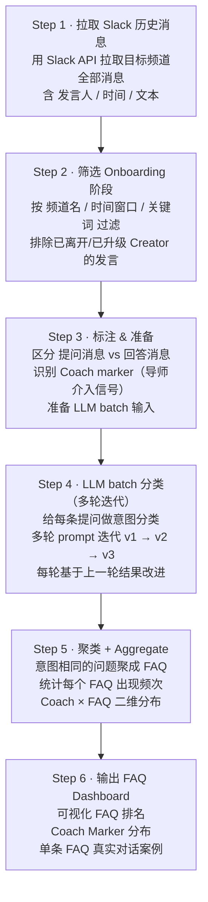

# 03 · Data Pipeline · 二期数据依据 · 让二期优化不是拍脑袋

> ⭐ 这是这个项目最特别的地方：**Bot 一期上线后，我用一套完整的数据分析 pipeline 跑出"二期该优化什么"**，而不是凭感觉猜。

## 🎯 The Question We Need To Answer

Bot 一期上线后，自然要做二期优化。但**优化什么？**

- "感觉 FAQ 答得不够好" → 哪些 FAQ？
- "感觉知识库覆盖不全" → 缺什么内容？
- "Coach 还是被问烦了" → 烦在哪些问题上？

**拍脑袋的优化 = 把团队的偏见放进 v2**——可能跟用户真实需求完全不沾边。

## 💡 The Answer · 拿历史数据说话

我设计了一套**多步 Python 分析 pipeline**，用历史 Slack 消息（迁移到 Discord 之前的）跑出真实 FAQ 分布：



## 📊 关键产出

### 1. FAQ 聚类排名
按真实历史频次排序的 FAQ list → 直接决定 Bot 知识库要先覆盖哪些问题。

### 2. Coach Marker 分布
"Coach 介入"的信号在哪些 FAQ 上最密集 → 这些是 **Bot 最该解决的问题**（因为 Coach 被问烦了）。

### 3. 单条 FAQ 的真实对话样本
每个 FAQ 配几条真实历史问答 → 直接成为 Bot 知识库的 ground truth。

## 🛠️ Engineering Highlights

### 多轮 Prompt 迭代
LLM 分类不是一次写好的——经过 **多轮 prompt 迭代（v1 → v2 → v3）**，每一轮基于上一轮的错误案例改进 prompt：

```
v1 prompt → 跑出来分类结果 → 人工 spot check 一些错的
   ↓
分析 v1 错在哪 → 改 prompt
   ↓
v2 prompt → 跑增量数据 → ...
   ↓
v3 prompt → 最终版
```

→ 这套迭代思路和 [ai-video-review-prompt-engineering](https://github.com/Vikki-L/ai-video-review-prompt-engineering) 里的 badcase 闭环是同一套方法论。

### 增量 batch
不是每次都跑全量数据（贵 + 慢），而是设计了**增量 batch**机制——只重新跑 prompt 变化影响的部分。

## 🎯 How This Drove v2 Bot Design

| Pipeline 发现 | 反哺到 v2 Bot |
|--------------|--------------|
| "提交视频流程" 是 #1 FAQ | v2 Bot 把这个流程放在欢迎消息最显眼位置 |
| "Coach 是谁" 高频被问 | v2 Bot 在邀请码识别后立刻告诉新人"你的 Coach 是 X" |
| "什么是 template" 在不同 Coach 群分布不均 | 说明部分 Coach 的内部解释不到位 → v2 Bot 主动推送 template 介绍 |
| 某些 FAQ 实际很少有人问 | 这些**不放进 v2 知识库**，避免知识库膨胀 |

---

## 💡 Generalizable Takeaway

> **任何 Bot/Agent 的 v2 优化都应该从 v1 历史数据里挖洞察**，而不是拍脑袋。

这套数据 pipeline 思路可以推广到：
- 客服 Bot 二期优化
- 内部助手 Bot 优化
- 任何"知识库类"产品的迭代

---

[← Back to README](../README.md)
